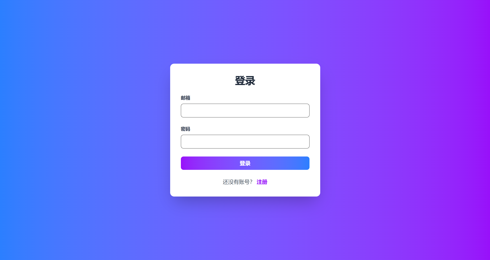
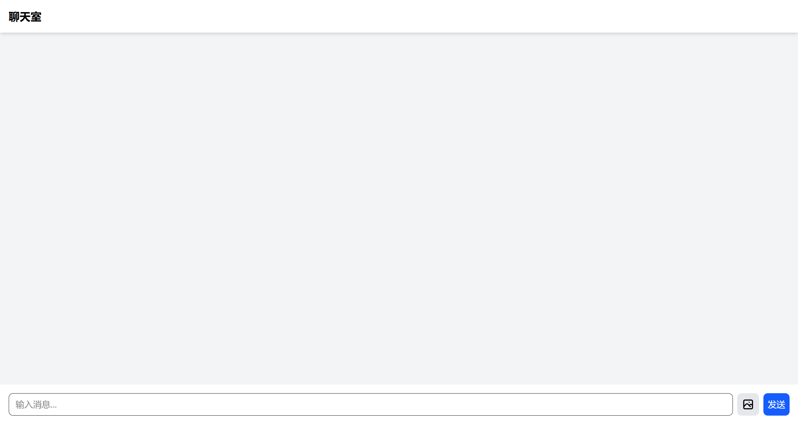

# frontend-zip

> 👿存储学习前端时，废弃的项目 ⚠️ 的项目

## supabase-chat

### Chat App Supabase (已废弃)

一个基于 Vue.js 和 Supabase 构建的实时聊天应用。

#### 技术栈

- Vue.js
- Supabase (实时数据库和认证)
- TailwindCSS 4
- Vite (构建工具)

#### 项目说明

本项目是一个实验性质的聊天应用，使用现代化的技术栈进行开发。由于项目方向调整，该项目已停止维护。

#### 主要功能

- 用户认证
- 实时消息
- 响应式设计

#### 展示

+ auth

+ chat

#### 废弃说明

该项目已不再维护，supabase 学习成本过高，但非常完善，值得学习，熟练后能够迅速成型项目。仅供参考和学习使用。建议使用其他活跃的替代方案。

## 许可证

MIT
